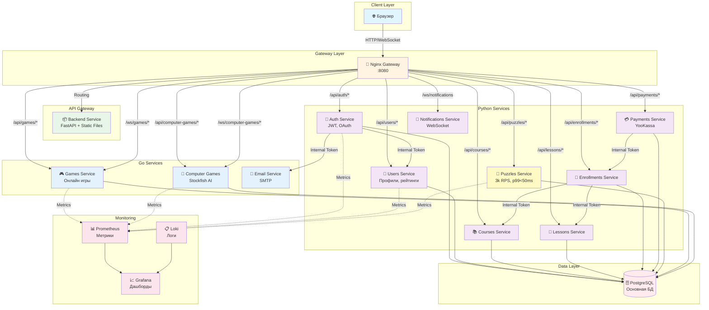

Шахматная платформа с микросервисной архитектурой.

## 🏗️ Архитектура

Проект построен на микросервисной архитектуре с использованием:
- **Backend**: Python (FastAPI) и Go (Gin)
- **Frontend**: Vanilla JavaScript, HTML, CSS
- **База данных**: PostgreSQL
- **Мониторинг**: Prometheus, Grafana, Loki
- **Контейнеризация**: Docker, Docker Compose

### Схема архитектуры



## 📦 Сервисы

### Python сервисы:
- **auth_service** - Аутентификация и авторизация (JWT)
- **users_service** - Управление пользователями, рейтингами, друзьями
- **courses_service** - Управление курсами
- **lessons_service** - Управление уроками и PGN файлами
- **enrollments_service** - Записи на курсы
- **payments_service** - Интеграция с YooKassa для платежей
- **puzzles_service** - Шахматные задачи и ежедневные пазлы
- **notifications_service** - WebSocket уведомления
- **backend** - API Gateway и статический фронтенд

### Go сервисы:
- **games_service_go** - Онлайн игры между пользователями
- **computer_games_service** - Игры против AI (Stockfish)
- **email_service_go** - Отправка email уведомлений

### Общие модули:
- **common** - Общие утилиты (конфигурация, БД, безопасность, логирование)

## 🚀 Быстрый старт

### Требования
- Docker и Docker Compose
- Python 3.12+ (для локальной разработки)
- Go 1.21+ (для локальной разработки Go сервисов)

### Запуск через Docker Compose

1. Скопируйте `.env.example` в `.env` и настройте переменные окружения
2. Запустите все сервисы:
```bash
docker-compose up -d
```

3. Примените миграции:
```bash
docker-compose up migrations
```

4. Откройте в браузере: http://localhost:8080

### Локальная разработка

Для локальной разработки используйте `docker-compose.local.yml`:
```bash
docker-compose -f docker-compose.local.yml up
```

## 📁 Структура проекта

```
.
├── auth_service/          # Сервис аутентификации
├── users_service/         # Сервис пользователей
├── courses_service/       # Сервис курсов
├── lessons_service/       # Сервис уроков
├── enrollments_service/   # Сервис записей
├── payments_service/      # Сервис платежей
├── puzzles_service/       # Сервис задач
├── notifications_service/ # Сервис уведомлений
├── backend/              # API Gateway + Frontend
│   ├── app/             # FastAPI приложение
│   └── web/             # Статический фронтенд
├── games_service_go/     # Онлайн игры (Go)
├── computer_games_service/ # Игры против AI (Go)
├── email_service_go/     # Email сервис (Go)
├── common/              # Общие модули
├── nginx/               # Nginx конфигурации
├── monitoring/          # Конфигурации мониторинга
└── docker-compose.yml   # Production конфигурация
```

## 📊 Мониторинг

- **Prometheus**: http://localhost:9090
- **Grafana**: http://localhost:3000 (admin/admin для локальной разработки)
- **Loki**: Логи через Grafana

## 🔒 Безопасность

- JWT токены для аутентификации
- Внутренние токены для межсервисной коммуникации
- Переменные окружения для секретов (не хранятся в коде)
- Валидация входных данных через Pydantic схемы

## 🚀 Technical Challenges & Solutions

### Производительность и оптимизации

#### 1. Оптимизация выборки случайных задач через TABLESAMPLE
**Проблема**: При ~1 млн задач в БД `ORDER BY random()` выполнялся 1-5 секунд.

**Решение**: Использование PostgreSQL `TABLESAMPLE SYSTEM` для выборки случайных страниц без полного сканирования таблицы.

**Реализация**: [`puzzles_service/app/services/puzzle_cache.py`](puzzles_service/app/services/puzzle_cache.py#L182-L197)
- Трехуровневая стратегия: TABLESAMPLE → случайное смещение по ID → fallback на ORDER BY random()
- Улучшение производительности: **100x быстрее** (с 1-5 сек до 4-10ms)


#### 2. Stale-while-revalidate паттерн для кеширования
**Проблема**: Обновление кеша блокировало запросы, создавая задержки.

**Решение**: Реализация stale-while-revalidate - возвращаем старый кеш, пока обновляется новый в фоне.

**Реализация**: [`puzzles_service/app/services/puzzle_cache.py`](puzzles_service/app/services/puzzle_cache.py#L53-L149)
- Кеш в памяти с TTL 30 минут
- Фоновое обновление через asyncio.create_task
- Гарантированная доступность данных (<1ms из кеша)

#### 3. Округление рейтинга для стабильности кеша
**Проблема**: Каждое изменение рейтинга создавало новый ключ кеша, снижая эффективность.

**Решение**: Округление рейтинга до кратного 50 для переиспользования кеша.

**Реализация**: [`puzzles_service/app/services/puzzle_cache.py`](puzzles_service/app/services/puzzle_cache.py#L30-L50)
- Формула: `Math.round(rating / 50) * 50`
- Снижение количества уникальных ключей кеша в 50 раз


#### 4. Оптимизация HTTP заголовков и кеширования
**Реализация**: [`backend/app/main.py`](backend/app/main.py#L85-L127)
- ETag для статических файлов
- Условные запросы (304 Not Modified)
- Разделение стратегий кеширования для dev/prod

## 🧪 Тестирование

### Unit тесты

```bash
# Python сервисы
cd puzzles_service
pytest tests/

# Go сервисы
cd games_service_go
go test ./...
```

**Покрытие тестами**:
- **Puzzles service**: 
  - Unit тесты для daily puzzle логики (`tests/test_daily_puzzle.py`)
  - API endpoint тесты (`tests/test_puzzles_api.py`) - 8 тестов
  - Cache service тесты (`tests/test_puzzle_cache.py`) - 7 тестов
- **Games service (Go)**: 
  - Handler тесты (`internal/handlers/games_test.go`) - 6 тестов
  - Computer games handler тесты (`internal/handlers/games_test.go`) - 4 теста

**Всего**: 25+ тестов покрывающих основные эндпоинты и бизнес-логику
