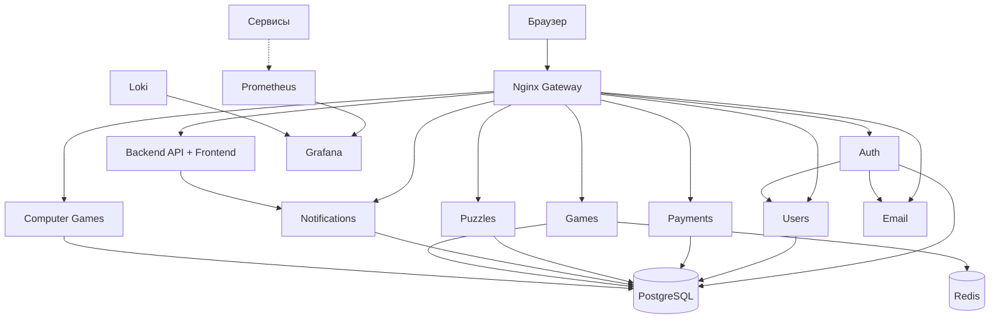

# ChessMint

ChessMint — шахматная платформа на микросервисах: партии между игроками, игры против Stockfish, задачи, профили и уведомления.

## Архитектура

Стек: FastAPI и Go/Gin, Vanilla JS/HTML/CSS, PostgreSQL, Redis, MinIO и Prometheus/Grafana/Loki. Сервисы запускаются через Docker Compose.



## Сервисы

- `auth_service` — регистрация, вход, JWT, OAuth и восстановление пароля.
- `users_service` — профили, рейтинги, друзья и школьные организации.
- `payments_service` — заказы и webhook YooKassa.
- `puzzles_service` — шахматные задачи и дневные подборки.
- `notifications_service` — уведомления и WebSocket.
- `games_service_go` — партии между игроками, matchmaking и WebSocket.
- `computer_games_service` — партии против Stockfish.
- `email_service_go` — отправка писем через SMTP.
- `backend` — API-шлюз и статический фронтенд.
- `common`, `go_shared` — общие Python- и Go-компоненты.

## Быстрый старт

Нужны Docker и Docker Compose. Для локальной разработки также полезны Python 3.12+ и Go 1.24+.

1. Скопируйте `.env.example` в `.env` и замените все значения-заглушки. Не используйте реальные секреты из старого `.env`: они должны быть отозваны и перевыпущены.
2. Запустите весь проект одной командой: PostgreSQL, Redis, миграции, все микросервисы, MinIO, мониторинг и gateway.

   ```bash
   docker compose up --build
   ```

   Точка входа: http://localhost:8080. Порты сервисов данных наружу не публикуются.

3. Для production используйте отдельный файл окружения и overlay:

   ```bash
   docker compose --env-file .env.production -f docker-compose.yml -f docker-compose.prod.yml up -d --build
   ```

   В `.env.production` задайте как минимум `GATEWAY_CONFIG=gateway.prod.conf`, `LETSENCRYPT_DOMAIN` и `LETSENCRYPT_EMAIL`.

Сервис `migrations` ждёт готовности PostgreSQL, затем создаёт схему Python-сервисов и общие таблицы `games` и `moves`. Зависимые сервисы запускаются только после успешных миграций.

## Структура проекта

```text
.
├── auth_service/
├── users_service/
├── payments_service/
├── puzzles_service/
├── notifications_service/
├── migrations_service/       # централизованные Alembic и SQL-миграции
├── backend/                  # FastAPI API + frontend
├── games_service_go/         # игры между игроками
├── computer_games_service/   # Stockfish
├── email_service_go/         # SMTP
├── common/                   # общие Python-компоненты
├── go_shared/                # общие Go-компоненты
├── nginx/
├── monitoring/
├── docker-compose.yml          # базовый локальный запуск и профили
└── docker-compose.prod.yml     # production overlay
```

## Конфигурация и безопасность

- JWT проверяется по `JWT_SECRET`, точному `JWT_ALGORITHM` и claim `type=access`.
- Внутренние HTTP-вызовы используют единый заголовок `X-Internal-Token`; отсутствие секрета считается ошибкой конфигурации.
- WebSocket-соединения принимаются только с origins из `WS_ALLOWED_ORIGINS`. Запросы без `Origin` разрешены для не-браузерных клиентов.
- Секреты должны храниться в `.env` или секрет-хранилище и не должны попадать в git. `.env` не передаётся контейнерам целиком: каждый сервис получает только свои переменные.

Для production заполните `LETSENCRYPT_DOMAIN`, `LETSENCRYPT_EMAIL`, SMTP-параметры, Grafana-учётные данные и `WS_ALLOWED_ORIGINS`. Для локального запуска в примере уже указаны origins `localhost` и `127.0.0.1`.

## Производительность

В `puzzles_service` используются выборка случайных страниц вместо постоянного `ORDER BY random()`, stale-while-revalidate для кеша и округление рейтинга в ключе кеша. Backend поддерживает ETag и ответы `304 Not Modified` для статических ресурсов.

## Проверки

```bash
cd games_service_go && go test ./... && go vet ./...
cd ../computer_games_service && go test ./... && go vet ./...
cd ../email_service_go && go test ./... && go vet ./...
```

Python-тесты запускаются из соответствующего сервиса командой `pytest tests/` после установки его requirements. Синтаксис JavaScript можно проверить командой `node --check <file.js>`.
