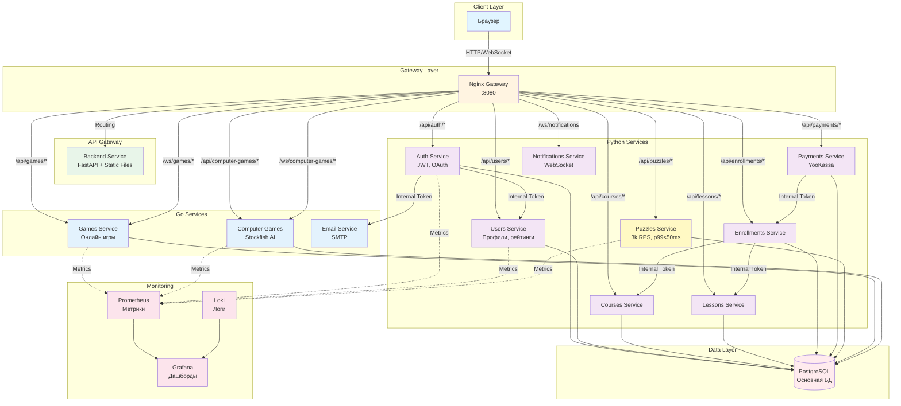

Шахматная платформа на микросервисах.

## Архитектура

Стек: Python (FastAPI) и Go (Gin) в бэкенде, Vanilla JS/HTML/CSS во фронте, PostgreSQL, мониторинг — Prometheus/Grafana/Loki, всё в Docker.

### Схема архитектуры



## Сервисы

**Python:** auth (JWT), users (профили, рейтинги, друзья), courses, lessons (PGN), enrollments, payments (YooKassa), puzzles (задачи и дневные пазлы), notifications (WebSocket), backend — шлюз и раздача статики.

**Go:** games_service_go (игры человек на человек), computer_games_service (игра против Stockfish), email_service_go (рассылка писем).

**Общее:** модуль `common` — конфиг, БД, безопасность, логирование.

## Быстрый старт

Нужны Docker, Docker Compose; для локальной разработки — Python 3.12+ и Go 1.21+.

1. Копируем `.env.example` в `.env`, подставляем свои значения.
2. Поднимаем сервисы: `docker-compose up -d`
3. Гоняем миграции: `docker-compose up migrations`
4. Открываем http://localhost:8080

Локально тот же сценарий через `docker-compose -f docker-compose.local.yml up`.

## Структура проекта

```
.
├── auth_service/          # Сервис аутентификации
├── users_service/         # Сервис пользователей
├── courses_service/       # Сервис курсов
├── lessons_service/       # Сервис уроков
├── enrollments_service/   # Сервис записей
├── payments_service/      # Сервис платежей
├── puzzles_service/       # Сервис задач
├── notifications_service/ # Сервис уведомлений
├── backend/              # API Gateway + Frontend
│   ├── app/             # FastAPI приложение
│   └── web/             # Статический фронтенд
├── games_service_go/     # Онлайн игры (Go)
├── computer_games_service/ # Игры против AI (Go)
├── email_service_go/     # Email сервис (Go)
├── common/              # Общие модули
├── nginx/               # Nginx конфигурации
├── monitoring/          # Конфигурации мониторинга
└── docker-compose.yml   # Production конфигурация
```

## Мониторинг

Prometheus — :9090, Grafana — :3000 (логин/пароль admin/admin), логи — в Loki, смотрятся из Grafana.

## Безопасность

Аутентификация по JWT, между сервисами — внутренние токены. Секреты только в переменных окружения, вход проверяется через Pydantic.

## Что делали по производительности

**Случайные задачи (puzzles).** На миллионе строк `ORDER BY random()` тормозило 1–5 секунд. Перешли на `TABLESAMPLE SYSTEM`: сначала берём случайные страницы, при необходимости — смещение по ID, и только в крайнем случае — старый способ. В итоге ~4–10 ms вместо секунд. Код: [`puzzle_cache.py`](puzzles_service/app/services/puzzle_cache.py#L182-L197).

**Кеш без просадок.** Пока кеш обновлялся, запросы ждали. Сделали stale-while-revalidate: отдаём старые данные, новый кеш подгружаем в фоне (asyncio.create_task). TTL 30 минут, ответ из кеша — доли миллисекунды. [`puzzle_cache.py`](puzzles_service/app/services/puzzle_cache.py#L53-L149).

**Рейтинг в ключе кеша.** Рейтинг менялся часто — ключи кеша множились. Округляем до 50 (`Math.round(rating / 50) * 50`), ключей стало в разы меньше. [`puzzle_cache.py`](puzzles_service/app/services/puzzle_cache.py#L30-L50).

**Статика и кеш в backend.** ETag, 304 Not Modified, разные настройки кеша для dev и prod. [`backend/app/main.py`](backend/app/main.py#L85-L127).

## Тесты

```bash
cd puzzles_service && pytest tests/
cd games_service_go && go test ./...
```

Есть тесты на daily puzzle, пазлы по API, кеш (puzzles_service), хендлеры и computer games (Go) — в сумме больше 25 тестов.
