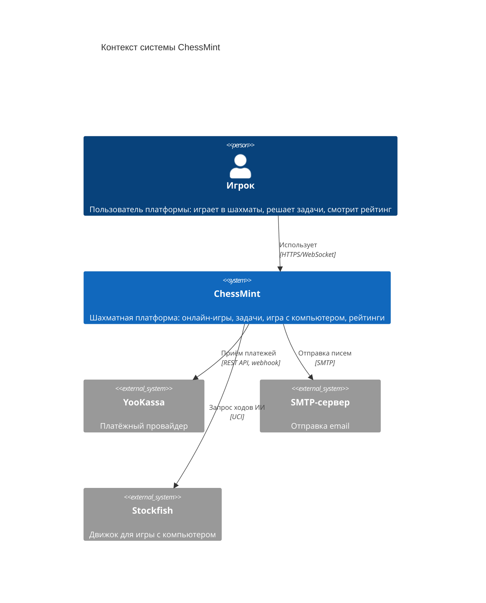
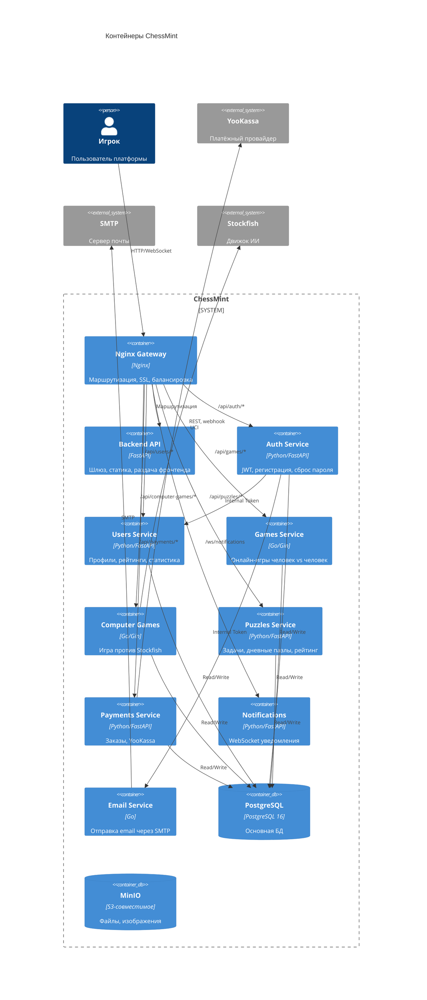
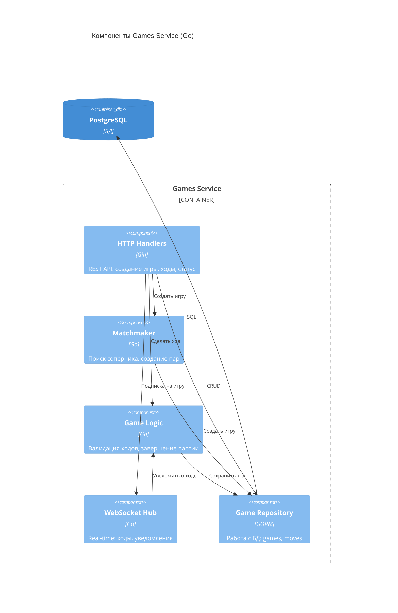
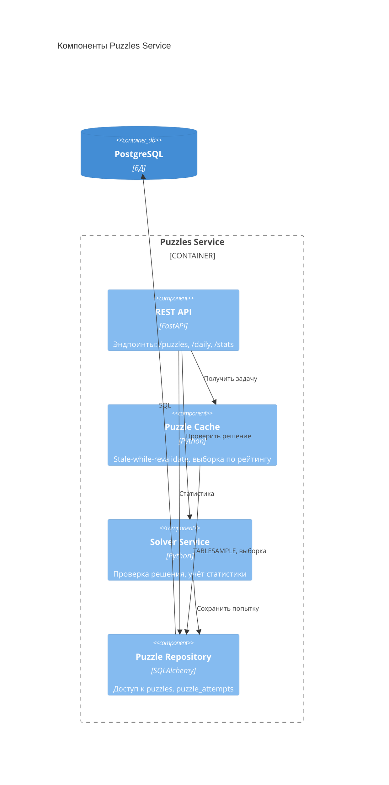
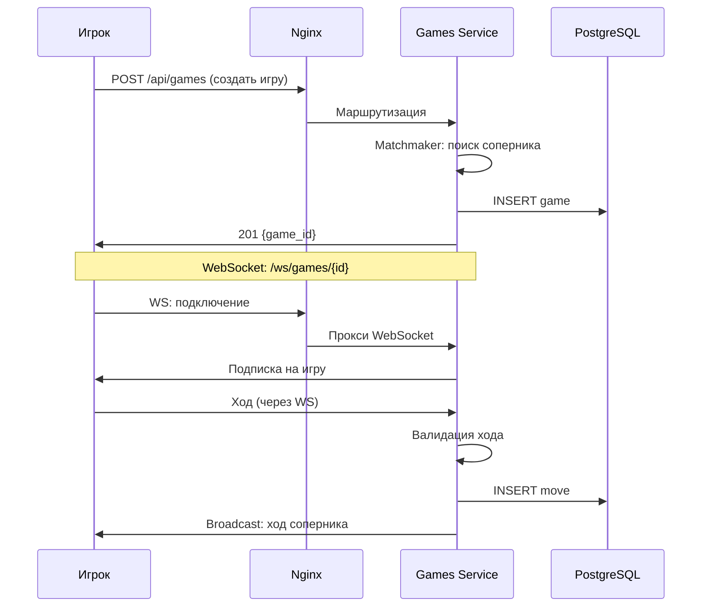
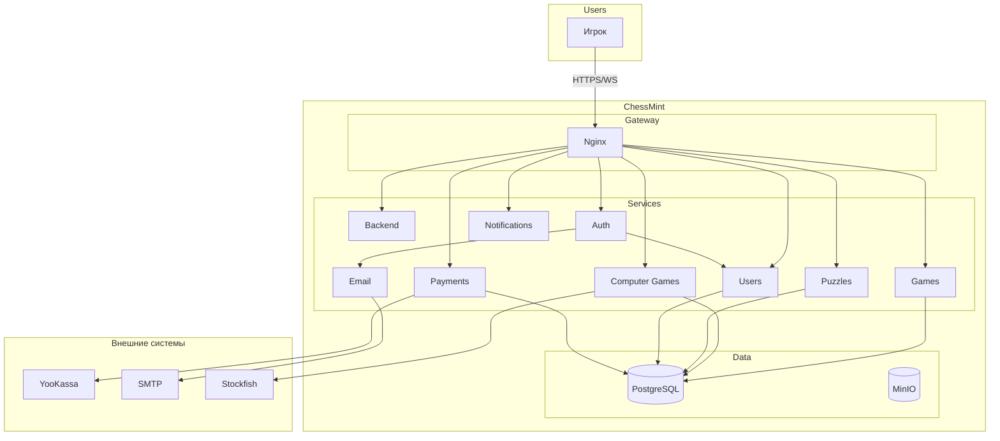

# Диаграммы C4 — архитектура ChessMint

Документация архитектуры информационной системы ChessMint с использованием модели C4 (Context, Container, Component).

---

## Легенда

| Обозначение | Описание |
|-------------|----------|
| **Person** | Пользователь системы (игрок) |
| **System** | Программная система |
| **System_Ext** | Внешняя система (не под нашим контролем) |
| **Container** | Приложение или сервис (выполняет код) |
| **ContainerDb** | Хранилище данных |
| **Component** | Компонент внутри контейнера |
| **Rel(A, B, label)** | Связь: A взаимодействует с B (label — описание) |
| **Boundary** | Граница системы или подсистемы |

---

## Уровень 1: System Context (Контекст системы)

Система в окружении пользователей и внешних систем.

---

## Уровень 2: Container (Контейнеры)

Основные приложения и сервисы внутри ChessMint.

---

## Уровень 3: Component — Games Service (пример)

Компоненты внутри сервиса онлайн-игр.

---

## Уровень 3: Component — Puzzles Service (пример)

Компоненты внутри сервиса задач.

---

## Поведение: сценарий «Создание онлайн-игры»

---

## Альтернатива: упрощённая схема (если C4 не поддерживается)

Если C4-диаграммы не отображаются в вашей среде, можно использовать обычный Mermaid flowchart:

---

## Примечания

- **Mermaid C4** — экспериментальный синтаксис (Mermaid 10+). Если диаграммы не отображаются, используйте упрощённую схему выше или [PlantUML](https://www.plantuml.com/plantuml) с [C4-PlantUML](https://github.com/plantuml-stdlib/C4-PlantUML).
- **Мониторинг** (Prometheus, Grafana, Loki) на диаграммах не показан — это операционная инфраструктура.
- **Internal tokens** — аутентификация между сервисами (Auth → Users, Auth → Email).
